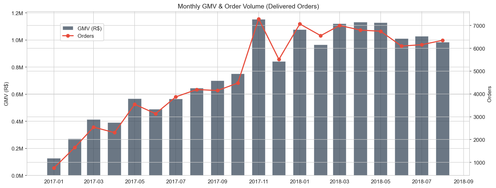
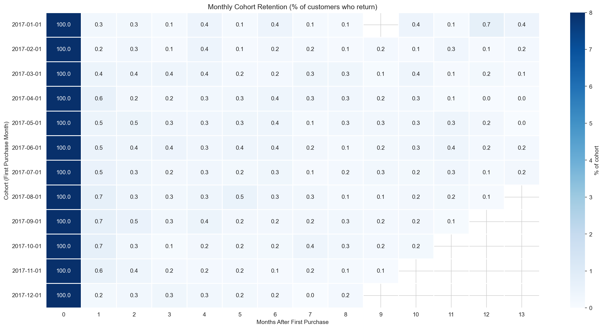
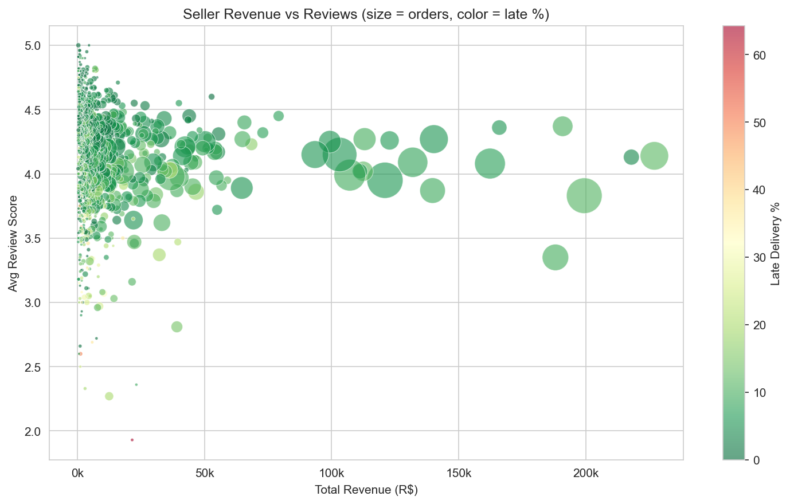

# Olist E-Commerce Marketplace Analysis

SQL analysis of a Brazilian e-commerce marketplace using PostgreSQL. Based on the [Olist dataset](https://www.kaggle.com/datasets/olistbr/brazilian-ecommerce) (~100k orders, 2016–2018).

**Stack:** PostgreSQL, Python, pandas, matplotlib, seaborn, Jupyter

---

## Setup

```bash
pip install -r requirements.txt
python setup.py          # downloads data from Kaggle, creates Postgres DB, loads tables
```

Needs a local PostgreSQL instance and [Kaggle API credentials](https://www.kaggle.com/docs/api).

---

## Schema

8 tables loaded via `schema.sql`:

- `orders` — 99k orders with timestamps for each fulfillment stage
- `order_items` — 112k line items with price and freight
- `order_payments` — 103k payment records (credit card, boleto, voucher, debit)
- `order_reviews` — 99k reviews with 1–5 star scores
- `customers` — 99k customers with city/state
- `sellers` — 3k sellers with city/state
- `products` — 32k products across 70+ categories
- `geolocation` — zip code coordinates

---

## Analysis

All in `analysis.ipynb`:

- Data overview and null audit
- Monthly revenue trends and Black Friday spike
- Day-of-week / hour-of-day ordering patterns
- Order funnel and cancellation breakdown
- Fulfillment timing and delivery time distribution
- Payment methods and installment behavior
- Product categories by revenue and reviews
- Geographic revenue distribution and cross-state shipping
- Freight cost patterns by weight and price bracket
- Monthly cohort retention
- Repeat customer behavior and time-to-second-purchase
- Seller performance scoring and concentration
- Late delivery impact on reviews (with t-test)
- Delivery accuracy by state
- Review score analysis
- RFM segmentation
- Correlation between order features and review scores







---

## Key Findings

- The marketplace grew steadily through 2017–2018 with a clear Black Friday spike
- Late delivery is the biggest driver of bad reviews — scores drop from ~4.2 to ~2.5 stars
- Retention is very low (~3% repeat rate) — typical for a general marketplace
- SP accounts for ~42% of GMV; top 3 states cover ~65%
- Freight is ~20% of GMV and can be 30–40% of the item price for cheap products
- Top 20% of sellers generate ~80% of revenue
- Northern states have worse logistics and higher late delivery rates

---

Requires Python 3.11.
